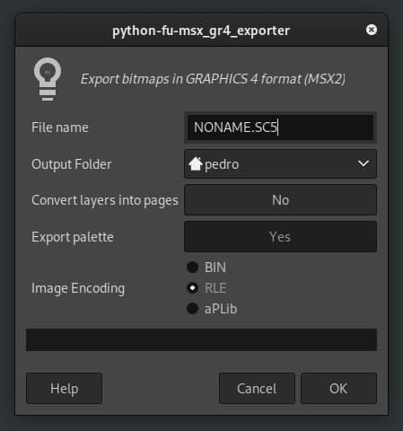

# gimpfu-msx-gr4.py



GIMP script to export bitmap as GRAPHICS 4 file (a.k.a. "SCREEN 5"). GRAPHICS 4 specs are: 

* 256x212 (or 256x192);
* 16 color palette (from 512);
* 4 pages;
* sprite mode 2;

## Sample image


## Installation: 
- Put this file into your GIMP plugin directory, i.e. `~/.var/app/org.gimp.GIMP/config/GIMP/2.10/plug-ins/gimpfu_msx_g4.py`
- Restart GIMP
- Run script via Filters/MSX/Export GRAPHICS 4 bitmap...

## Loading bin (.SC5) files

You may load files created by this plug-in using this simple code in BASIC:
```
10 SCREEN 5
20 VDP(9)=VDP(9) OR &H20
30 BLOAD"NONAME.SC5",S
40 BLOAD"NONAME.PAL",S
50 COLOR=RESTORE
60 IF INKEY$ = "" GOTO 60
```
First file (NONAME.SC5) is the pattern data and second (NONAME.PAL) is the palette.

## TODO

* ordered dithering;
* make it faster;
* ~~palette export;~~
* ~~RGB to indexed conversion;~~
* RLE encoding;
* aPLib compression;
* converting layers into pages;
